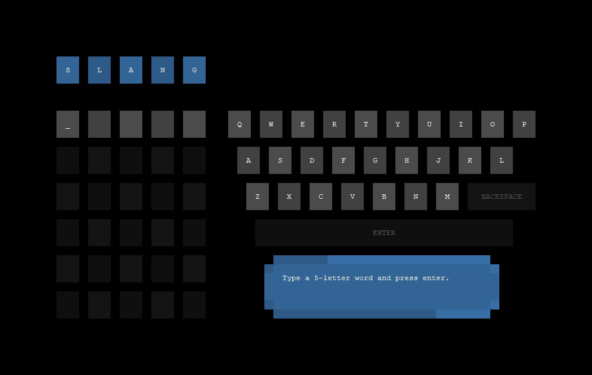
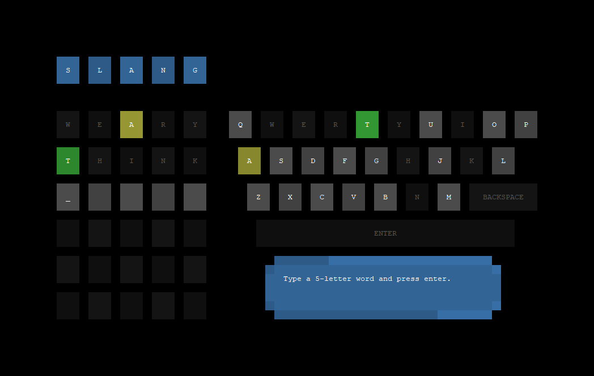

# Slang

### Description

Slang is an alternative to Wordle created by three students at Kutztown University in the spring semester of 2022.

### Assigned Tasks

- Henry Morales: Client, Team Management
- Patrick Perrin: Server
- Isaiah Rovenolt: Library

### How to Compile from "src" Directory

You must have GNU Make or an equivalent Makefile interpreter installed.

`make slang`

### How to Run the Server from "src" Directory

`make start`

or

`./slang-server [port]`

e.g.

`./slang-server 46257`

### How to Run the Client from "src" Directory

`make connect`

or

`./slang-client <host> [port]`

e.g.

`./slang-client acad.kutztown.edu 46257`

### Design Decisions

On Henry's part, the client handles only alphabetical characters.  The client wraps your guess (e.g. "GUESS"), in parentheses, with a 'G' prefix (e.g. "G(GUESS)").  The first character specifies the type of message (and the length is known), the parentheses allow the receiving end to make sure that the entire message is read.  It will stop reading after that.  Other technical features can be found in documentation provided to the class.  A user interface was designed, and you can supply a number of command-line arguments (see "./slang-client --help").

On Patrick's part, the server uses a hash map and vector of acceptable words.  The vector is used to choose a random word to send to each client, while the hash map is used to verify if any given word from a client's guess should be accepted.  The server-client relationship is explained in full by documentation shared with the class.

On Isaiah's part, a static library was chosen for the program.  This decision was purely practical, as the executables would not have to be shipped with dynamic libraries or other supporting files, they can operate independently.  The exception to this is that the server requires a word list (words.txt) to function properly.  The standard Wordle words were used, but you can change this file to contain any 5-letter group of words.

### Known Issues

CLIENT:
- There is no error checking for `fprintf` calls to the client's log file.  I realized this without enough time to update everything before the due date.
- Some terminals cannot access the full client experience due to incompatibilities with ANSI escape codes.  Because of this, user experience will vary.  This is not something that can be standardized.
- Alternative color schemes were not implemented due to time constraints.
LIBRARY:
- `SlangLib` is vulnerable to being deleted without proper cleanup if the destructor is called before `killThreads`.
SERVER:
- The read functions to vector and hashmap independently open and close the `words.txt` file.  Hypothetically, the file could be modified between the execution of the two functions, which would cause desynchronization between accepted words and possible answers.  The odds of this happening are practically zero, but this could be remedied by reading from the file into the vector, then reading from the vector into the hash map.

### Communication

We worked together both in person and via a Discord chat server.  Using Discord, we were able to stream our screens to each other in real time.  This allowed us to collaborate properly without updating the shared repository as often.  We used GitHub to post updated versions of our files so everybody could have the most recent version of the codebase.  We collaborated on most of the codebase, not only our assigned areas.  `client.cpp` is the only exception, which was written entirely by Henry.  We made sure to explain to each other how our code worked so that anybody modifying it would be sure not to break anything.  We did not run code through an automatic formatting tool, so the files were largely formatted by the team member in charge of that section.

### Program

